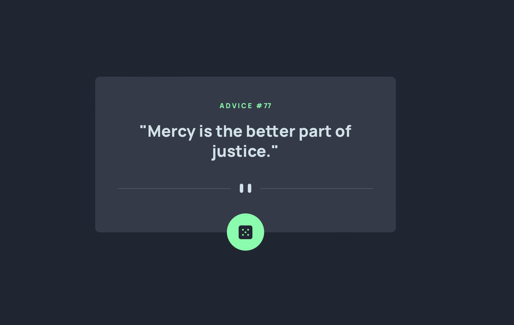

# Frontend Mentor - Advice generator app solution

This is a solution to the [Advice generator app challenge on Frontend Mentor](https://www.frontendmentor.io/challenges/advice-generator-app-QdUG-13db). Frontend Mentor challenges help you improve your coding skills by building realistic projects.

## Table of contents

- [Overview](#overview)
  - [Screenshot](#screenshot)
  - [Links](#links)
- [My process](#my-process)
  - [Built with](#built-with)
  - [What I learned](#what-i-learned)
  - [Continued development](#continued-development)
- [Author](#author)


## Overview

### Screenshot



### Links

- Github: [https://github.com/javidVeg/advice-generator-app-main](https://github.com/javidVeg/advice-generator-app-main)
- Live Site: [https://javidveg.github.io/advice-generator-app-main/](https://javidveg.github.io/advice-generator-app-main/)

## My process

### Built with

- HTML5 markup
- [React](https://reactjs.org/) - JS library
- [Vite](https://vitejs.dev) - React framework
- [TailwindCSS](https://tailwindcss.com) - CSS framework

### What I learned

This challenge was a great refresher for API's! Super simple but still a good way to test my knowledge by not using to many online resources!

```js
module.exports = {
  content: [
    "./index.html",
    "./src/**/*.{js,ts,jsx,tsx}",
  ],
  theme: {
    fontSize: {
      "15px": ['15px', {
        fontWeight: '700',
        lineHeight: '1.2rem'
      }],
      "11px": ['11px', {
        fontWeight: '400',
        lineHeight: '.8rem'
      }]
    },
    fontFamily: {
      'outfit': ['Outfit', 'sans-serif']
    },
   
    extend: { 
      colors: {
      'Grayish-blue': 'hsl(220, 15%, 55%)',
      'Dark-blue': 'hsl(218, 44%, 22%)'
    },},
  },
  plugins: [],
}
```
### Continued development

This is my first time using Vite with React and Tailwind together and I am glad I chose this project to do so because there was a lot of cobwebs on my tailwind skills that I needed to brush off. This project also allowed me to get a better grasp of how to implement Vite. This will be my stack from this point forward while completing Frontend Mentor challenges. 

## Author

- Website - [David Martinez](https://dev-idcodes.com)
- Frontend Mentor - [@javidVeg](https://www.frontendmentor.io/profile/javidVeg)


